# TryHackMe - Blog Writeup

<p align="center">
  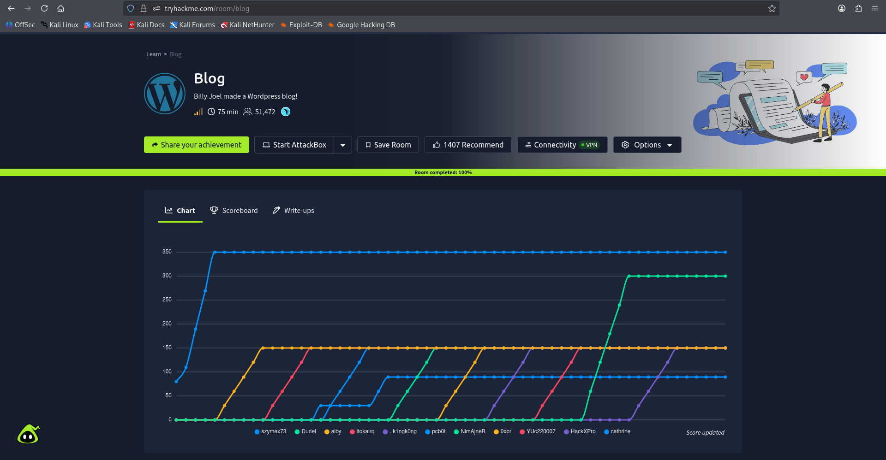
</p>

<p align="center">


</p>

---

# Table of Contents

* Introduction
* Room Information
* Objectives
* Methodology
* Reconnaissance
* Enumeration
* Authentication Assessment
* Initial Access Overview
* Privilege Escalation Overview
* Attack Chain
* MITRE ATT&CK Mapping
* Skills Demonstrated
* Tools Used
* Screenshot Gallery
* Security Recommendations
* Lessons Learned
* Conclusion
* Disclaimer

---

# Introduction

The **Blog** room focuses on assessing a WordPress-based environment through a structured penetration testing methodology.

The assessment demonstrates how publicly accessible services, application enumeration, authentication weaknesses, and insecure system configuration can combine to create an attack path from initial reconnaissance to full system compromise.

This repository documents the methodology, observations, and security lessons learned during the assessment without disclosing sensitive room solutions.

---

# Room Information

| Property         | Value            |
| ---------------- | ---------------- |
| Platform         | TryHackMe        |
| Room             | Blog             |
| Difficulty       | Easy             |
| Category         | Web Exploitation |
| Operating System | Linux            |
| Web Application  | WordPress        |

---

# Objectives

* Perform reconnaissance
* Enumerate exposed services
* Assess WordPress security
* Identify authentication weaknesses
* Obtain initial access
* Perform privilege assessment
* Document findings professionally

---

# Methodology

The assessment followed a standard penetration testing workflow.

```
Reconnaissance
        │
        ▼
Service Enumeration
        │
        ▼
Web Enumeration
        │
        ▼
WordPress Enumeration
        │
        ▼
Authentication Assessment
        │
        ▼
Authenticated Assessment
        │
        ▼
Local Enumeration
        │
        ▼
Privilege Assessment
```

---

# Reconnaissance

Connectivity to the target was verified before enumeration.

### Host Discovery

```bash
ping TARGET_IP
```

**Screenshot**

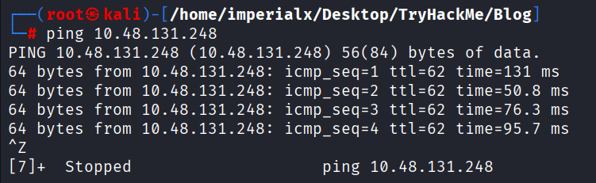

---

# Network Enumeration

A full service and version scan was performed.

Example command:

```bash
nmap -A -v -T4 TARGET_IP
```

## Key Findings

* SSH exposed
* HTTP service available
* SMB services accessible
* Linux operating system identified
* Apache web server detected

**Screenshot**

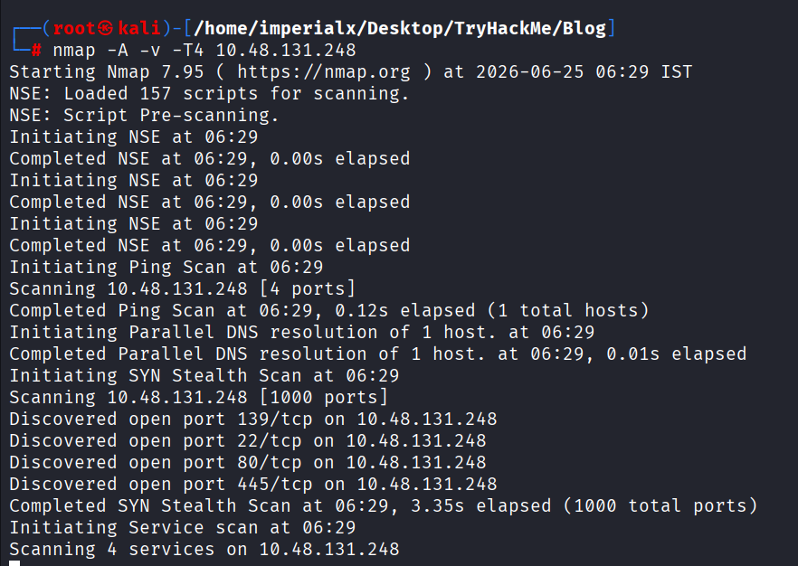

---

# Web Enumeration

Browsing the target identified a WordPress installation.

Observations included:

* Public blog
* robots.txt available
* WordPress metadata exposed

**Screenshot**

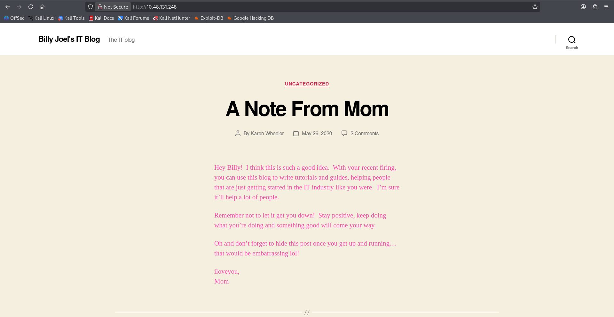

---

## robots.txt

The robots file revealed administrative paths.

**Screenshot**

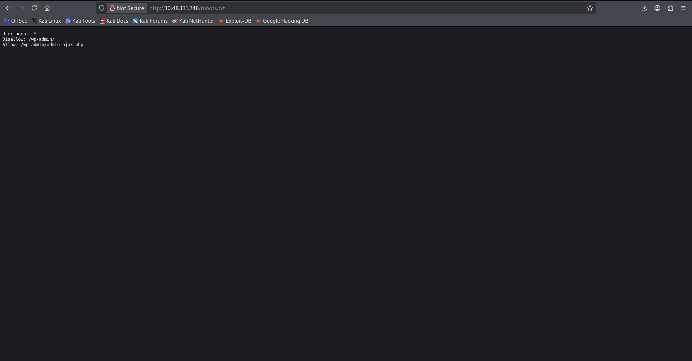

---

# WordPress Enumeration

WPScan was used to enumerate the application.

The assessment identified:

* WordPress version
* XML-RPC enabled
* Upload directory listing
* Public usernames
* Additional application metadata

Example:

```bash
wpscan --url http://TARGET_IP -e
```

**Screenshot**

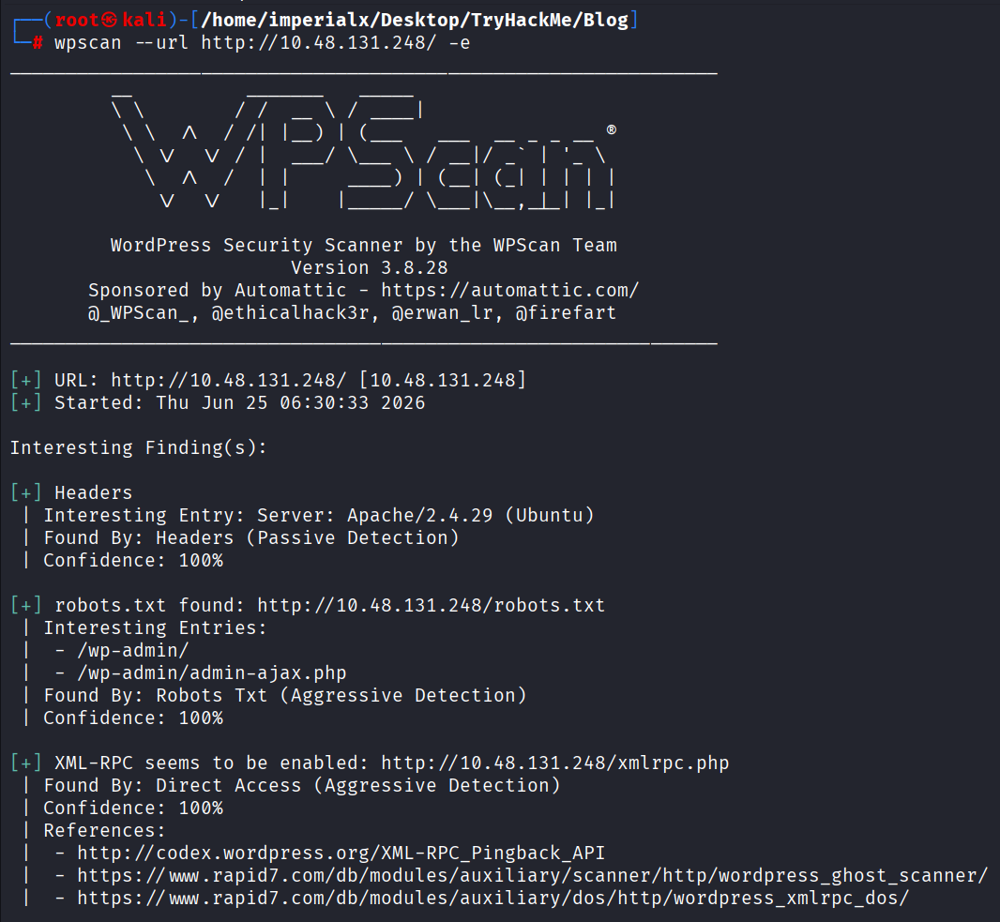

---

# Authentication Assessment

Publicly exposed usernames increase the attack surface.

Authentication testing confirmed that the application configuration allowed successful login using a weak credential set.

For ethical reasons, recovered credentials are intentionally omitted from this repository.

**Screenshot**

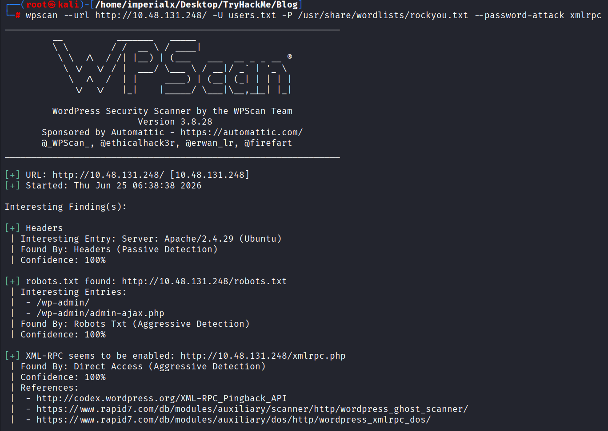

---

# Initial Access Overview

After obtaining valid application access, the environment was assessed for authenticated functionality.

The assessment confirmed that authenticated features could be leveraged to achieve code execution under the web server context.

The implementation details are intentionally omitted from this public repository.

**Screenshot**

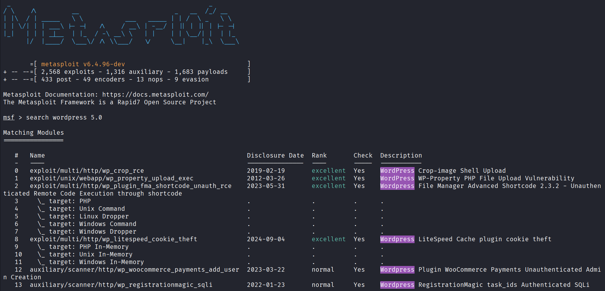

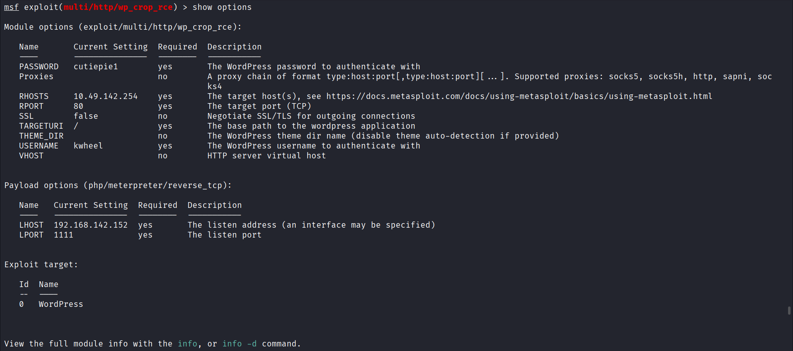
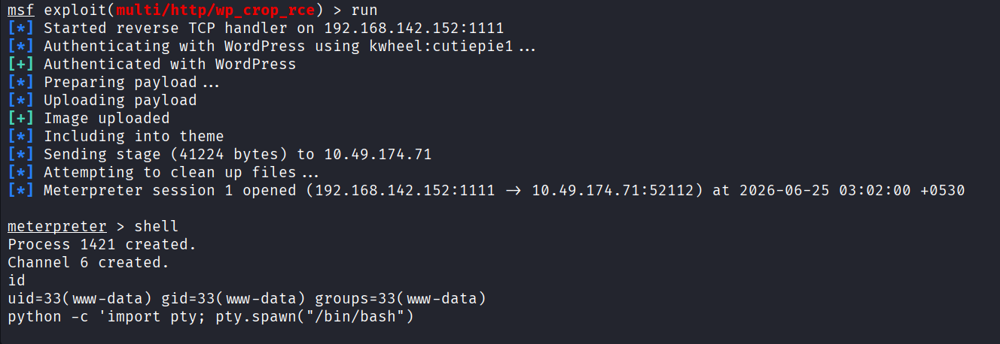

--- 

## Interactive Shell

After establishing an initial session, an interactive Linux shell was obtained to continue local enumeration and inspect the target environment. 

**Screenshot** 

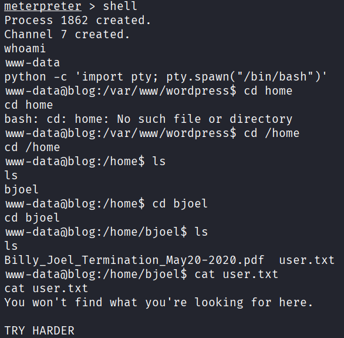 

---

# Local Enumeration

System enumeration was performed to identify users, services, binaries, and potential privilege escalation vectors. 

Typical areas of focus included: 

- User and group information
- File system layout
- SUID binaries
- Running services
- System configuration
 
 
 **Screenshot**
 
 
 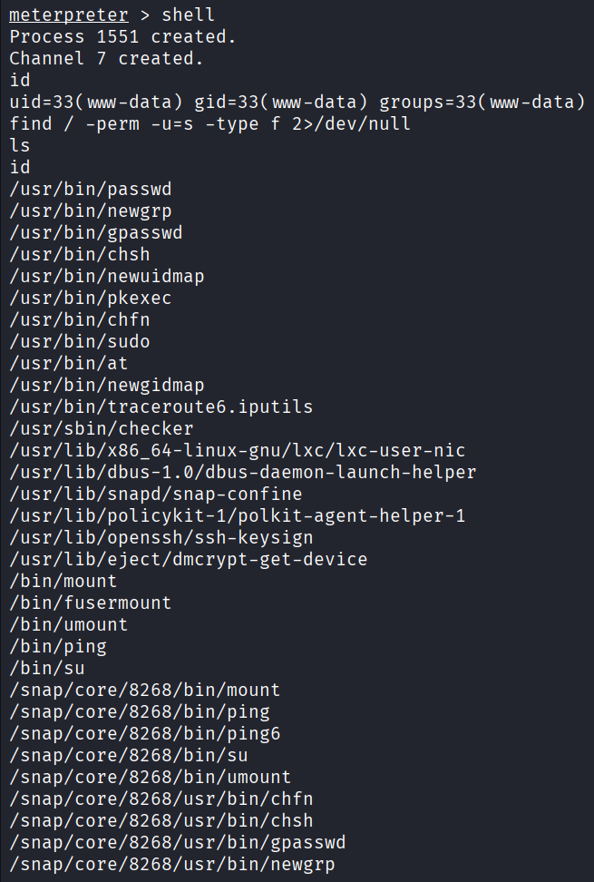

 
---

## Privilege Assessment

During local enumeration, an application-specific executable was identified and analyzed as part of the privilege assessment process. 

The implementation details are intentionally omitted from this public repository. 

**Screenshot** 

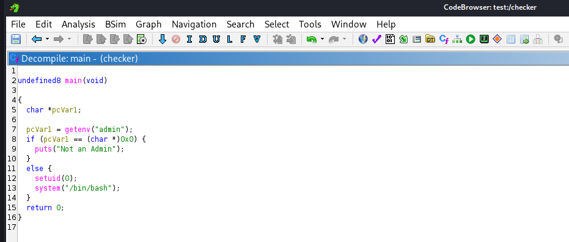 

---

## Privilege Escalation

Overview Following the assessment of the local environment, administrative privileges were successfully obtained. 

This repository intentionally omits the technical exploitation details while documenting the overall assessment methodology. 

**Screenshot** 

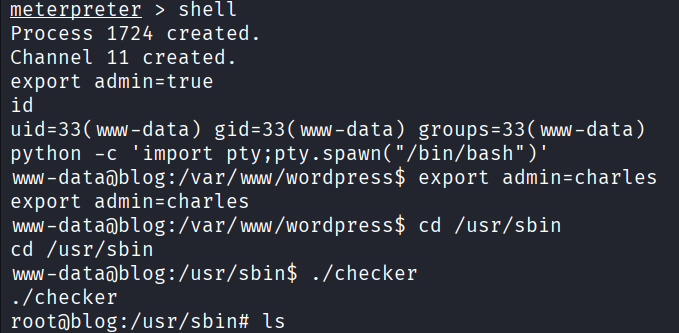 

--- 

## User Proof 

The user-level objective was successfully verified. 

**Screenshot** 

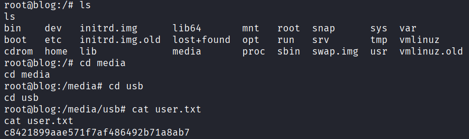 

--- 

## Administrative Proof 

Administrative access to the target system was successfully verified. 

**Screenshot** 

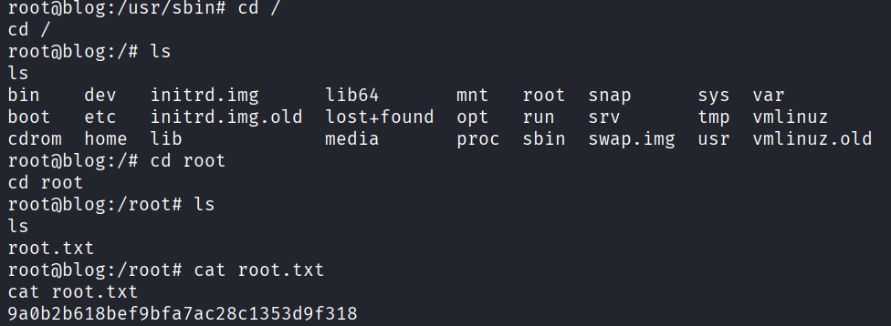 

---

# Attack Chain

```
Reconnaissance
        │
        ▼
Service Enumeration
        │
        ▼
WordPress Enumeration
        │
        ▼
Authentication Assessment
        │
        ▼
Authenticated Access
        │
        ▼
Application Assessment
        │
        ▼
Local Enumeration
        │
        ▼
Privilege Assessment
        │
        ▼
Administrative Access
```

---

# MITRE ATT&CK Mapping

| Technique | Description                       |
| --------- | --------------------------------- |
| T1595     | Active Scanning                   |
| T1046     | Network Service Discovery         |
| T1083     | File and Directory Discovery      |
| T1033     | System Owner/User Discovery       |
| T1069     | Permission Group Discovery        |
| T1078     | Valid Accounts                    |
| T1059     | Command and Scripting Interpreter |

---

# Skills Demonstrated

* Network Enumeration
* Nmap
* WordPress Enumeration
* WPScan
* Authentication Assessment
* Linux Enumeration
* Privilege Assessment
* Documentation
* Reporting

---

# Tools Used

* Kali Linux
* Nmap
* WPScan
* Metasploit Framework
* Linux Utilities
* Python
* SMB Enumeration Tools

---

# Screenshot Gallery

```
images/
│
├── room.png
├── ping.png
├── nmap.png
├── website.png
├── robots.png
├── wpscan.png
├── password-attack.png
├── metasploit-search.png
├── exploit-options.png
├── session.png
├── shell.png
├── enumeration.png
├── checker.png
├── privilege-escalation.png
├── user-proof.png
└── root-proof.png
```

---

# Security Recommendations

* Enforce strong password policies.
* Disable unused WordPress features such as XML-RPC where appropriate.
* Restrict public information disclosure.
* Apply security updates promptly.
* Limit administrative access.
* Review file permissions regularly.
* Audit custom privileged executables.

---

# Lessons Learned

This room reinforced the importance of combining multiple low-severity findings to understand overall risk. It also emphasized the value of systematic enumeration, thorough documentation, and reviewing application-specific components during a security assessment.

---

# Conclusion

The Blog room provided practical experience with web application assessment, WordPress enumeration, authenticated testing, Linux post-exploitation, and privilege assessment. Completing this room strengthened both technical methodology and reporting skills, while highlighting common security issues found in self-hosted web applications.

---

# Disclaimer

This repository is provided for educational and portfolio purposes only.

It intentionally omits exploit details, credentials, flags, and other sensitive information to respect the TryHackMe platform and encourage hands-on learning. Perform security testing only on systems for which you have explicit authorization.
